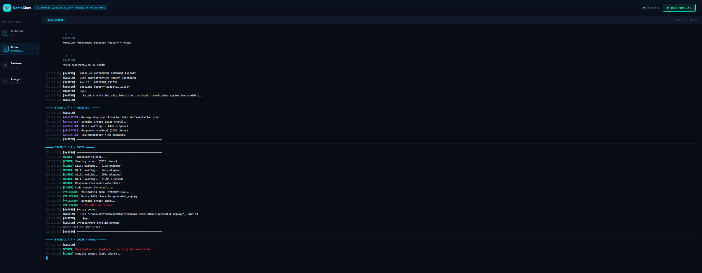

# 🦞 NemoClaw Autonomous Software Factory




**A four-agent AI pipeline that takes a plain-English specification and autonomously produces a working city infrastructure health dashboard — entirely on-premises.**

Built on [NVIDIA NemoClaw](https://github.com/NVIDIA/NemoClaw) + [HP ZGX Nano AI Station](https://www.hp.com/us-en/workstations/zgx.html). No cloud. No human intervention. A prompt goes in, a working application comes out.


---

## What It Does

A plain-English prompt like *"Build a real-time city infrastructure health monitoring system for 6 districts"* triggers a fully autonomous pipeline:

| Stage | Agent | Sandbox | Model | Role |
|-------|-------|---------|-------|------|
| 1 | **Architect** | `openshell-architect` | Qwen3-32B | Decomposes the spec into a structured implementation plan |
| 2 | **Coder** | `openshell-coder` | Qwen3-Coder-30B | Implements the plan as a FastAPI application |
| 3 | **Reviewer** | `openshell-reviewer` | Qwen3-Coder-30B | Reviews code, catches issues, requests revisions |
| 4 | **Analyst** | `openshell-analyst` | Qwen3-Coder-30B | Generates the data visualization logic for the dashboard |

Each agent runs in its own isolated NemoClaw sandbox with Landlock filesystem restrictions, seccomp system call filtering, and network namespace isolation. Agents cannot see each other's work, access the host, or make unauthorized network calls.

The pipeline includes a self-healing loop: if the Coder's output fails validation, the error is fed back for autonomous correction. If the Reviewer rejects the code, issues are routed back to the Coder. A golden-path fallback ensures the demo never fails live.

**Output:** A standalone HTML dashboard with live Chart.js visualizations, district health cards, anomaly alerts, and a dark mission-control theme — all running from `file://` with zero server dependency.

---

## Demo Flow

### Terminal Mode
```bash
python3 orchestrator.py
# → Runs the full pipeline
# → Opens output/dashboard.html when complete
```

### Live UI Mode
```bash
python3 ui_server.py
# → Opens a browser-based mission control UI
# → Hit RUN PIPELINE and watch agents work in real time
```

The live UI streams agent activity via WebSocket — color-coded log output, pipeline stage indicators, elapsed timer, and a link to the generated dashboard when complete.

---

## Architecture

```
┌─────────────────────────────────────────────────────────┐
│  HOST (HP ZGX Nano)                                     │
│                                                         │
│  ┌───────────────────────────────────────────────────┐  │
│  │  orchestrator.py                                   │  │
│  │  Coordinates agents via SSH + openclaw CLI          │  │
│  │  Validates code, manages retries, streams logs      │  │
│  └──────────┬──────────┬──────────┬──────────┬───────┘  │
│             │          │          │          │           │
│      ┌──────▼───┐ ┌────▼────┐ ┌───▼─────┐ ┌─▼──────┐   │
│      │Architect │ │ Coder   │ │Reviewer │ │Analyst │   │
│      │Sandbox   │ │Sandbox  │ │Sandbox  │ │Sandbox │   │
│      │Qwen3-32B │ │Coder-30B│ │Coder-30B│ │Coder-30B│  │
│      └──────────┘ └─────────┘ └─────────┘ └────────┘   │
│       Landlock │ seccomp │ netns — per sandbox          │
│                                                         │
│  ┌───────────────────────────────────────────────────┐  │
│  │  Ollama (serves both models on localhost:11434)    │  │
│  └───────────────────────────────────────────────────┘  │
│                                                         │
│  ┌───────────────────────────────────────────────────┐  │
│  │  ui_server.py (port 8888) — Live browser UI        │  │
│  └───────────────────────────────────────────────────┘  │
└─────────────────────────────────────────────────────────┘
```

---

## Project Structure

```
nemoclaw-demo/
├── orchestrator.py              # Main pipeline orchestrator
├── ui_server.py                 # Live browser UI (FastAPI + WebSocket)
├── prompts/
│   ├── architect.txt            # Spec → implementation plan
│   ├── coder_initial.txt        # Plan → code (skeleton-based)
│   ├── coder_retry.txt          # Error feedback → fixed code
│   ├── reviewer.txt             # Code → binary verdict
│   ├── analyst.txt              # → generateData() function
│   └── dashboard_template.html  # Pre-built dashboard UI template
├── fallback/
│   ├── generated_app.py         # Golden-path FastAPI backend
│   └── dashboard.html           # Golden-path dashboard
├── output/                      # Pipeline-generated files (gitignored)
├── logs/                        # Per-run logs (gitignored)
└── .gitignore
```

---

## Prerequisites

- **Hardware:** HP ZGX Nano AI Station (or any NVIDIA GPU system with 64GB+ memory)
- **NemoClaw:** Installed and running (`nemoclaw --help`)
- **OpenShell:** CLI available (`openshell --help`)
- **Ollama:** Running with models pulled:
  - `qwen3:32b` (Architect — dense 32B, strong instruction following)
  - `qwen3-coder:latest` (Coder/Reviewer/Analyst — 30B MoE, code-specialized)
- **Python 3.10+** on the host
- **pip packages:** `fastapi`, `uvicorn`, `websockets`

---

## Setup

### 1. Pull Models

```bash
ollama pull qwen3:32b
ollama pull qwen3-coder:latest
```

### 2. Patch NemoClaw Token Limit

NemoClaw hardcodes `maxTokens: 4096` — too low for code generation. Patch before creating sandboxes:

```bash
NEMOCLAW_PATH=$(dirname $(dirname $(readlink -f $(which nemoclaw))))
sed -i "s/'maxTokens': 4096/'maxTokens': 16384/" "$NEMOCLAW_PATH/lib/node_modules/nemoclaw/Dockerfile"
```

### 3. Create Sandboxes

Create the Architect sandbox with `qwen3:32b`:

```bash
nemoclaw onboard
# Choose: Local Ollama → qwen3:32b → name: architect
# If sandbox creation fails on policy error, note the image tag and run:
openshell sandbox create --name architect --from openshell/sandbox-from:<IMAGE_TAG>
```

Create the other three with `qwen3-coder`:

```bash
nemoclaw onboard
# Choose: Local Ollama → qwen3-coder:latest → name: coder
# Note the image tag, then:
openshell sandbox create --name coder --from openshell/sandbox-from:<IMAGE_TAG>
openshell sandbox create --name reviewer --from openshell/sandbox-from:<IMAGE_TAG>
openshell sandbox create --name analyst --from openshell/sandbox-from:<IMAGE_TAG>
```

### 4. Verify

```bash
ssh -o BatchMode=yes openshell-architect "echo OK"
ssh -o BatchMode=yes openshell-coder "echo OK"
ssh -o BatchMode=yes openshell-reviewer "echo OK"
ssh -o BatchMode=yes openshell-analyst "echo OK"
```

### 5. Install Python Dependencies

```bash
pip install fastapi uvicorn websockets --break-system-packages
```

---

## Usage

### Run Pipeline (Terminal)

```bash
python3 orchestrator.py
```

Output lands in `output/dashboard.html` — open it in any browser.

### Run Pipeline (Live UI)

```bash
python3 ui_server.py
```

Open the Network URL it prints (e.g., `http://192.168.x.x:8888`) in your browser. Click **RUN PIPELINE**.

---

## Key Design Decisions

### Why Two Models?

Qwen3-32B (dense) follows prescriptive instructions reliably — critical for the Architect producing a plan with exact values. Qwen3-Coder-30B-A3B (MoE, 3B active) is optimized for code generation but substitutes training priors for prompt values. Right model for each cognitive task.

### Why Skeleton-Based Code Generation?

Small models blow their output budget on boilerplate. The Coder prompt provides an 80% complete skeleton with TODOs — the model fills in 15-30 lines of logic instead of generating 120 lines from scratch.

### Why Template Injection for the Dashboard?

The model's natural output limit is ~2,000 characters. A complete Chart.js dashboard is 6,000+. The Analyst generates only the `generateData()` function, and the orchestrator injects it into a pre-built template. The model contributes what it's good at; the template provides what needs to be pixel-perfect.

### Why a Golden-Path Fallback?

Live demos can't fail. If any stage exhausts its retries, the orchestrator copies known-good files from `fallback/` to `output/`. The audience sees a working dashboard regardless.

### Why `--thinking off`?

Qwen3-Coder uses internal reasoning tokens by default. These consume output budget without appearing in the response. `--thinking off` on every `openclaw agent` call recovered ~50% of usable output capacity.

### Why Unique Session IDs?

OpenClaw accumulates conversation history within a session. The Coder retrying three times with the same session ID stuffs the context window with prior failures, squeezing output. Each call gets a fresh session.

---

## Security Story

This demo exists to answer one question: *"What's actually stopping the AI from doing something it shouldn't?"*

Each NemoClaw sandbox enforces:

| Layer | What It Does |
|-------|-------------|
| **Landlock** | Filesystem restricted to `/sandbox` and `/tmp` |
| **seccomp** | System calls filtered — unauthorized calls fail silently |
| **Network namespace** | No direct egress — only `inference.local` reachable |
| **Inference routing** | Agents hit `inference.local`; gateway routes to Ollama; agent never sees host IPs |

The orchestrator is the **operator** — a trusted host-side process that moves artifacts between sandboxes. Agents never communicate directly. The Reviewer can't reach into the Coder's sandbox. The Coder can't see the Reviewer's critique until the orchestrator delivers it.

**Compliance by architecture, not configuration.**

---

## Troubleshooting

| Symptom | Cause | Fix |
|---------|-------|-----|
| Sandbox creation fails with policy error | NemoClaw v0.1.0 YAML parsing bug | Use `openshell sandbox create --from <image>` |
| Agent output truncated | `maxTokens: 4096` hardcoded | Patch Dockerfile, rebuild sandboxes |
| Agent returns prose instead of code | Missing `--thinking off` or weak prompt | Add `--thinking off`, start prompt with "Output ONLY..." |
| Tool-call XML in output | OpenClaw agent framework artifacts | Orchestrator strips with regex |
| Live UI shows "disconnected" | Accessing via `localhost` from remote machine | Use the ZGX Nano's network IP |
| Live UI shows no log output | Python stdout buffering | `print(..., flush=True)` + `PYTHONUNBUFFERED=1` |
| Port 8080 in use | NemoClaw gateway | UI server uses port 8888 |
| Coder retries produce worse code | Session context accumulation | Unique session ID per call |

---

## Developer Guide

For a comprehensive walkthrough of every setup pattern, workaround, and debugging approach, see the full developer guide:

📖 **[Agentic AI with NemoClaw — Developer Guide](https://huggingface.co/spaces/curtburk/nemoclaw-developer-guide)**

---

## Built With

- [HP ZGX Nano AI Station](https://www.hp.com/us-en/workstations/zgx.html) — NVIDIA GB10 Grace Blackwell, 128GB unified memory
- [NVIDIA NemoClaw](https://github.com/NVIDIA/NemoClaw) — Sandboxed AI agent runtime
- [OpenShell](https://openshell.dev) — Sandbox orchestration CLI
- [Qwen3-32B](https://huggingface.co/Qwen/Qwen3-32B) — Dense instruction-following model
- [Qwen3-Coder-30B-A3B](https://huggingface.co/Qwen/Qwen3-Coder-30B-A3B-Instruct) — Code-specialized MoE model
- [Ollama](https://ollama.com) — Local model serving
- [Chart.js](https://www.chartjs.org) — Dashboard visualizations

---

## Author

**Curtis Burke** — Technical Product Marketing Manager, AI Solutions at HP

- [GitHub](https://github.com/curtburk)
- [LinkedIn](https://linkedin.com/in/curtburk)

---

## License

MIT
